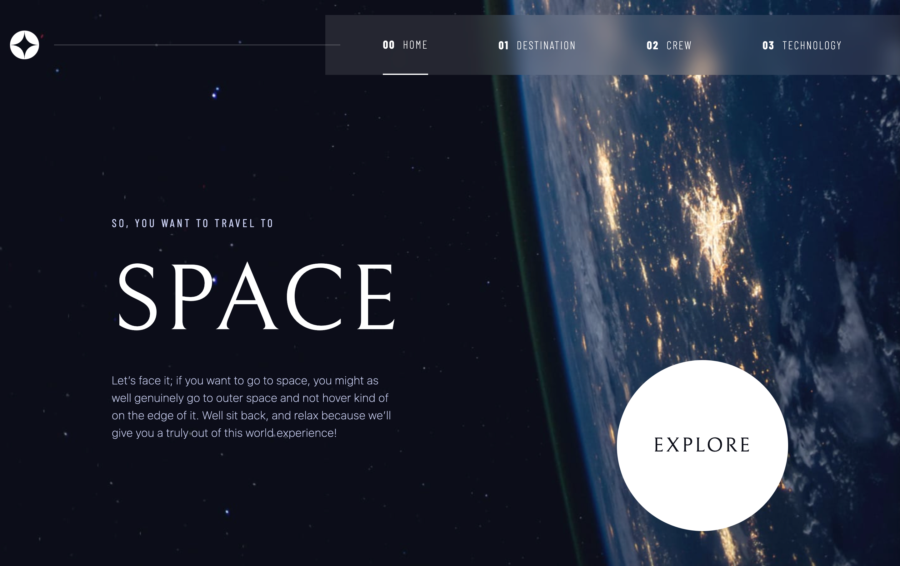

# Frontend Mentor - Space tourism website solution

This is a solution to the [Space tourism website challenge on Frontend Mentor](https://www.frontendmentor.io/challenges/space-tourism-multipage-website-gRWj1URZ3). Frontend Mentor challenges help you improve your coding skills by building realistic projects.

## Overview

### The challenge

Users should be able to:

- View the optimal layout for each of the website's pages depending on their device's screen size
- See hover states for all interactive elements on the page
- View each page and be able to toggle between the tabs to see new information

### Screenshot

### Links

- Solution URL: [Github repo](https://github.com/Sana-Shabeel/space-tourism-ts)
- Live Site URL: [App on netlify](https://space-tourism-abarre.netlify.app/)

## My process

### Built with

- Semantic HTML5 markup
- CSS custom properties
- Flexbox
- CSS Grid
- Mobile-first workflow
- [React](https://reactjs.org/) - JS library
- [React router](https://reactrouter.com/en/main) - React framework
- [TailwindCss](https://tailwindcss.com/) - For styles

## Author

- Website - [Portfolio](https://anas-barre.netlify.app/)
- Frontend Mentor - [@Sana-Shabeel](https://www.frontendmentor.io/profile/Sana-Shabeel)

## Acknowledgments

[Create a Design System with CSS ](https://www.youtube.com/watch?v=lRaL-8qZ0mM&list=PLsg4qApL5sH7woiAyt4jdSwR8DQwm2sae&index=35&t=1110s) - A css course by Kevin Powell
